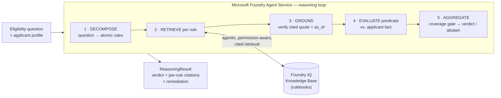

# 🧾 Batayan — AI that argues with receipts

> **Batayan is a reasoning agent that decides what you're *entitled* to — and proves every "yes" and "no" with the exact rule and citation — built on Microsoft Foundry with Foundry IQ.**

[](#-reliability-measured-not-claimed)
[](#-reliability-measured-not-claimed)
[](#)
[](#-how-it-works-microsoft-foundry--foundry-iq)
[](LICENSE)

🎥 **Demo video:** [`docs/batayan-demo.mp4`](docs/batayan-demo.mp4) — a ~90-second narrated walkthrough of the three reasoning beats.

**Batayan** *(Filipino: basis, grounds, foundation)* is a submission for the **Microsoft Agents League Hackathon — Reasoning Agents track**. It turns an eligibility question into a transparent, multi-step argument: it **decomposes** the question into atomic rules, **retrieves a citation for each rule** from a Foundry IQ knowledge base, **reasons** over the whole set of constraints, and returns a verdict that is either **proven** or **honestly abstained** — never guessed.

```
Question      : Am I eligible for DOST-SEI?
▸ PLAN — decomposed into 6 atomic rule(s)
▸ EVIDENCE LEDGER
  [3] financial_need                 ✗ FAIL
      evidence  : grounded "...household income must not exceed PHP 400,000." (as of 2026-01-15)
      check     : Not satisfied: household_income_annual ≤ 400000 (actual: 650000)
      fix       : Household income is above the cap. Consider a merit-only scholarship...
▸ VERDICT: ✗ INELIGIBLE — Fails 1 rule: financial_need. All 6 decisive rules were grounded and checked.
▸ YOU MAY STILL QUALIFY ELSEWHERE
  ✔ CHED Tulong-Dunong Grant — All 4 decisive rules are satisfied and individually cited.
```

---

## 🌟 Why this exists

Every day, people are told **"you don't qualify"** — for a scholarship, a benefit, an insurance claim, a visa — and *never told why*. The rules are real, but they're scattered across PDFs, they contradict each other, and the systems that apply them are black boxes. A plain chatbot makes this **worse**: it will confidently hallucinate a verdict.

Batayan's contract is the opposite: **it will never assert a verdict it cannot cite, and it will abstain rather than guess.** A denial comes with the exact rule that caused it *and the single thing you can do about it.*

---

## 🎯 What it does

- **Decomposes** an eligibility question into atomic, independently-checkable rules (a *reasoning* step, not a retrieval step).
- **Grounds every rule** in a cited source passage — source file, section, and the rule's effective **`as_of`** date — so verdicts stay auditable even after a rulebook changes.
- **Returns three outcomes, not two:** `ELIGIBLE`, `INELIGIBLE`, or **`INSUFFICIENT_EVIDENCE`**. Abstention is a first-class, celebrated result.
- **Gates confidence on coverage:** if any decisive rule can't be grounded *or* the applicant hasn't provided the needed fact, Batayan abstains and tells you exactly what's missing.
- **Turns a "no" into a path forward:** auto-refers you to other programs you *do* qualify for, and gives a concrete fix for each failed rule.
- **Is rulebook-agnostic:** the same engine adjudicates student scholarships *and* an enterprise HR leave policy with **no code change** — only the knowledge base differs.

---

## 🧠 How it works — Microsoft Foundry + Foundry IQ

Batayan is the same agent in two interchangeable run modes that share **one** result contract (`ReasoningResult`):

| | **Offline mode** (default) | **Foundry mode** (`--engine foundry`) |
|---|---|---|
| Orchestration | Local, deterministic reasoning loop | **Microsoft Foundry Agent Service** runs the multi-step thread |
| Retrieval & grounding | Local cited corpus + quote verification | **Foundry IQ** — agentic, permission-aware retrieval with extractive citations |
| Dependencies | **Zero** (stdlib only) → reliable on stage | `azure-ai-projects`, `azure-identity` |
| Purpose | The demo runs anywhere, no Azure needed | Real cloud integration, env-gated |



**Why Foundry IQ (the required Microsoft IQ layer)?** The reasoning track is scored 60% on reasoning + reliability + accuracy. Foundry IQ is purpose-built for *agentic knowledge retrieval*: it decomposes complex queries, runs permission-aware retrieval across knowledge sources, and returns **grounded answers with extractive citations** — which is *exactly* what a trustworthy eligibility verdict needs. The offline engine mirrors this same decompose → retrieve → ground → decide loop so every claim in this README is true in both modes.

> 📄 Architecture deep-dive: [`docs/architecture.md`](docs/architecture.md) · Safety model: [`docs/safety.md`](docs/safety.md)

---

## 🏃 Run it locally (zero dependencies)

Requires **Python 3.10+**. The offline engine needs nothing else.

```bash
git clone https://github.com/aint-vscp/batayan-agent
cd batayan-agent
pip install -e .            # installs the `batayan` command (no runtime deps)

# Or run with no install at all:
#   $env:PYTHONPATH="src"; python -m batayan demo      (PowerShell)
#   PYTHONPATH=src python -m batayan demo               (bash)
```

### The 60-second demo (three reasoning beats + the reuse beat)
```bash
batayan demo
```

### Ask one question
```bash
batayan ask "Am I eligible for DOST-SEI?" --applicant examples/liza.json     # ELIGIBLE, fully cited
batayan ask --program "DOST-SEI"          --applicant examples/mateo.json    # INELIGIBLE + referral
batayan ask --program "DOST-SEI"          --applicant examples/aisha.json    # abstains (missing income)
batayan ask --program "parental leave"    --applicant examples/employee-ramon.json   # same engine, HR rulebook
batayan ask --program "DOST-SEI" --applicant examples/liza.json --json       # machine-readable result
```

### Explore
```bash
batayan programs     # list every program across knowledge bases
batayan kb           # list knowledge bases and their cited sources
batayan eval         # run the labelled eval set → confusion matrix
```

### Run on Microsoft Foundry (real Foundry IQ)
```bash
pip install -e .[foundry]
cp .env.example .env          # fill in your Foundry endpoint, model, Foundry IQ KB
batayan ask --program "DOST-SEI" --applicant examples/liza.json --engine foundry
```

---

## 🔬 Reliability, measured (not claimed)

Batayan ships its own labelled evaluation set (`eval/dataset.json`, 15 cases across two knowledge bases, balanced across all three verdict classes). Ground truth is *unarguable* because the rulebooks are self-authored.

```text
cases: 15   accuracy: 100.0%

expected \ predicted  ELIG      INELIG    ABSTAIN
ELIG                  4         0         0
INELIG                0         7         0
ABSTAIN               0         0         4

★ abstention recall (correctly refused to guess): 100.0%
★ denial precision  (no wrongful 'ineligible'):    100.0%
```

`batayan eval` exits non-zero if any case is wrong, so it doubles as a **reproducible reliability gate** — run it locally, or via the included GitHub Actions workflow (`.github/workflows/ci.yml`) when Actions is enabled on the account.

---

## 🛡️ Safety model

Batayan is engineered around the failure modes that sink LLM agents:

| Pitfall | Batayan's defense |
|---|---|
| Hallucinated verdicts | Every decisive rule must be **grounded in a cited quote** or the verdict abstains. |
| Confidently wrong "no" | **Denial precision** is measured; a denial always names the failing rule + a fix. |
| Guessing on missing data | **`INSUFFICIENT_EVIDENCE`** is a native output; coverage gating blocks confident verdicts. |
| Stale rules | Every citation carries an **`as_of`** date; verdicts remain auditable across rulebook versions. |
| Over-permissioned data | Maps to **Foundry IQ's permission-aware retrieval** (Purview sensitivity labels) in cloud mode. |
| Tampered sources | Grounding re-verifies the quote against the source; a missing/edited quote → abstain (tested). |

> ⚠️ The bundled rulebooks are **simplified and illustrative** for the demo — *not* official scholarship or HR criteria. Batayan's role is to reason over *whatever rulebook it is given* and prove its verdict, not to be the source of truth.

---

## ♿ Accessibility & inclusion

- **Plain-language verdicts** — the output reads as a human explanation, not a model dump; the on-screen gloss always defines *Batayan = basis / grounds*.
- **No-color / screen-reader friendly** — honours `NO_COLOR`; the trace is linear text that reads cleanly aloud.
- **Low-resource by design** — the offline engine has zero dependencies and runs on any machine with Python; no GPU, no paid API, no connectivity required to get a grounded answer.
- **Built for the under-served** — the demo domain targets first-generation students navigating opaque scholarship rules.

---

## 🔁 One engine, any rulebook (Best Use of IQ)

Eligibility is the same reasoning problem as HR benefits, insurance adjudication, and regulatory KYC. Batayan ships **two** knowledge bases to prove the engine is the product:

- `knowledge/scholarships/` — DOST-SEI & CHED Tulong-Dunong (student scholarships)
- `knowledge/hr-leave/` — Acme Corp paid parental leave (enterprise policy)

Add a new domain by dropping a `manifest.json`, a prose rulebook, and a `*.rules.json` into `knowledge/` — **no code changes.**

---

## 🗂️ Project layout

```
batayan-agent/
├── src/batayan/
│   ├── schema.py        # ReasoningResult contract (verdict, outcomes, citations)
│   ├── knowledge.py     # knowledge bases, offline agentic retrieval, grounding
│   ├── reasoner.py      # the multi-step loop: decompose → retrieve → ground → decide
│   ├── foundry.py       # env-gated Foundry Agent Service + Foundry IQ integration
│   ├── evaluate.py      # eval harness + confusion matrix + abstention recall
│   └── cli.py           # the legible "evidence ledger" CLI
├── knowledge/           # two knowledge bases (cited rulebooks + structured rules)
├── examples/            # applicant/employee profiles for the demo beats
├── eval/dataset.json    # labelled evaluation set (ground truth)
└── tests/               # behavioural tests (eligible / ineligible / abstain / grounding)
```

---

## 👥 Team

| Name | Role | Background |
|---|---|---|
| **Vash Puno** | Lead / Engineer / Pitch | Microsoft Student Ambassador · President, PUP Microsoft Student Community · Cloud Architect (Azure) |

---

## 📜 License

MIT — see [LICENSE](LICENSE).

---

*Built for the Microsoft Agents League Hackathon (Reasoning Agents track), 2026. "Batayan" — because every answer deserves a basis.*
